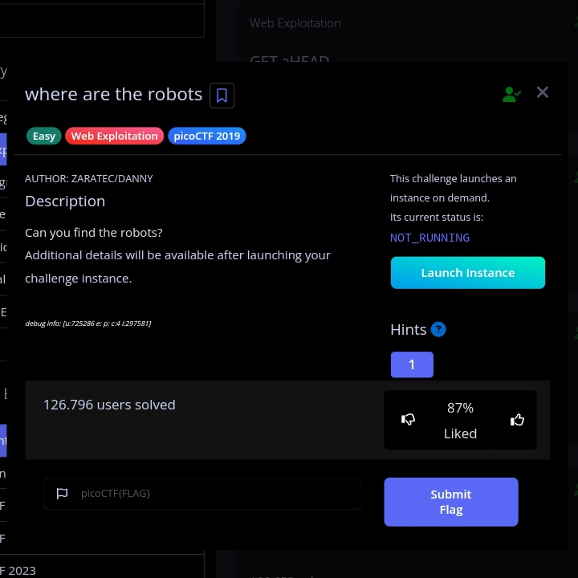

======================================================== 
                 SECURITY REPORT 
            WHERE ARE THE ROBOTS 
======================================================== 

 
[EXECUTIVE SUMMARY] 
Challenge ini menunjukkan bagaimana file robots.txt 
dapat mengungkap path sensitif jika tidak disertai 
mekanisme kontrol akses yang memadai. 
 
robots.txt bukan sistem keamanan, melainkan hanya 
petunjuk untuk crawler mesin pencari. 
 
======================================================== 
 
[CHALLENGE DETAILS] 
Challenge Name : Where Are The Robots 
Platform       : picoCTF 
Category       : Web Exploitation 
Difficulty     : Easy 
Flag Format    : picoCTF{...} 
 
======================================================== 
 
[METHODOLOGY] 
1. Melakukan enumerasi awal terhadap target. 
2. Mengakses endpoint umum yang sering digunakan 
   untuk discovery informasi tersembunyi. 
3. Menganalisis isi file robots.txt. 
4. Mengakses path yang ditemukan. 
 
======================================================== 
 
[TECHNICAL ANALYSIS] 
Langkah-langkah eksploitasi: 
 
1. Launch instance challenge. 
2. Buka URL target yang diberikan. 
3. Tambahkan endpoint berikut: 
 
   /robots.txt 
 
Contoh: 
https://target-url.com/robots.txt 
 
4. File robots.txt menampilkan path tersembunyi: 
 
   Disallow: /hidden-path/ 
 
5. Akses path tersebut melalui browser. 
6. Halaman yang terbuka berisi flag challenge. 
 
======================================================== 
 
[IMPACT ANALYSIS] 
Jika dalam sistem nyata developer menyimpan 
informasi sensitif hanya dengan menyembunyikannya 
di dalam robots.txt tanpa autentikasi server-side, 
maka data tersebut dapat diakses oleh publik. 
 
Potensi risiko: 
- Information Disclosure 
- Exposure of Sensitive Files 
- Increased Attack Surface 
 
======================================================== 
 
[RECOMMENDATION] 
- Jangan mengandalkan robots.txt untuk keamanan. 
- Terapkan autentikasi dan otorisasi yang benar. 
- Batasi akses file sensitif melalui konfigurasi server. 
 
======================================================== 
 
# Hunter: trzy
